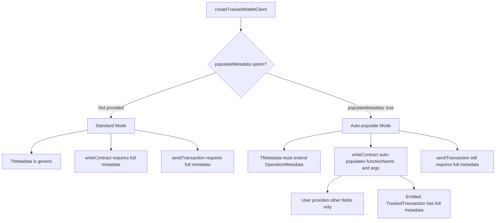

# Auto-Populate Operation Metadata for writeContract

## Overview

This plan describes how to add automatic population of `functionName` and `args` fields in metadata when using `writeContract` and `writeContractSync` methods.

## Requirements

1. Add a `{populateMetadata: true}` option to `createTrackedWalletClient`
2. When `populateMetadata` is enabled:
   - `TMetadata` defaults to `OperationMetadata` if not specified
   - Custom `TMetadata` must extend `OperationMetadata`
   - `writeContract`/`writeContractSync` auto-populate `functionName` and `args`
   - Metadata parameter excludes `functionName`/`args` fields (user cannot override)
   - Other required fields in custom metadata must still be provided
3. `sendTransaction`/`sendRawTransaction` still require full metadata (including `functionName`/`args`)

## Type Design

### Base Operation Metadata Type

```typescript
/**
 * Base metadata type for contract operations.
 * When using populateMetadata: true, TMetadata must extend this type.
 */
export type OperationMetadata = {
  functionName: string;
  args?: readonly unknown[];
};
```

### Factory Options

```typescript
/**
 * Options for createTrackedWalletClient.
 */
export interface TrackedWalletClientOptions {
  /**
   * When true, writeContract and writeContractSync automatically populate
   * functionName and args in the metadata from the contract call parameters.
   */
  populateMetadata?: boolean;
}
```

### API Variants

The factory will have two overload patterns:

```typescript
// Standard API - no auto-population
function createTrackedWalletClient<TMetadata>(): TrackedWalletClientBuilder<TMetadata>;

// Auto-populate API - metadata defaults to OperationMetadata
function createTrackedWalletClient(options: {populateMetadata: true}): TrackedWalletClientBuilder<OperationMetadata>;

// Auto-populate API with custom metadata extending OperationMetadata
function createTrackedWalletClient<TMetadata extends OperationMetadata>(
  options: {populateMetadata: true}
): TrackedWalletClientBuilder<TMetadata>;
```

### WriteContract Metadata Handling

When `populateMetadata: true`:

```typescript
/**
 * For writeContract with auto-population enabled:
 * - Exclude functionName and args from the metadata parameter
 * - Auto-populate these fields from the contract call
 */
type WriteContractMetadataField<TMetadata> = 
  Omit<TMetadata, 'functionName' | 'args'> extends Record<string, never>
    ? { metadata?: never }  // No other fields required, metadata is optional
    : { metadata: Omit<TMetadata, 'functionName' | 'args'> };
```

### Type Flow Diagram



## Implementation Details

### 1. New Types in types.ts

Add to [`packages/viem-tx-tracker/src/types.ts`](packages/viem-tx-tracker/src/types.ts:1):

```typescript
/**
 * Base metadata type for contract write operations.
 * Contains the function call information.
 */
export type OperationMetadata = {
  functionName: string;
  args?: readonly unknown[];
};

/**
 * Options for creating a tracked wallet client.
 */
export interface CreateTrackedWalletClientOptions<TPopulate extends boolean = false> {
  /**
   * When true, writeContract and writeContractSync automatically populate
   * functionName and args in the metadata from the contract call parameters.
   * TMetadata must extend OperationMetadata when this is enabled.
   */
  populateMetadata?: TPopulate;
}

/**
 * Metadata field for writeContract when auto-population is enabled.
 * Excludes functionName and args since they will be auto-populated.
 */
export type WriteContractAutoPopulateMetadata<TMetadata extends OperationMetadata> =
  keyof Omit<TMetadata, 'functionName' | 'args'> extends never
    ? { metadata?: Omit<TMetadata, 'functionName' | 'args'> }
    : undefined extends Omit<TMetadata, 'functionName' | 'args'>[keyof Omit<TMetadata, 'functionName' | 'args'>]
      ? { metadata?: Omit<TMetadata, 'functionName' | 'args'> }
      : { metadata: Omit<TMetadata, 'functionName' | 'args'> };
```

### 2. TrackedWriteContractParameters Variants

Need two variants of the parameters type:

```typescript
// Standard version - uses MetadataField<TMetadata>
export type TrackedWriteContractParameters<TMetadata, ...> = /* existing */;

// Auto-populate version - excludes functionName/args from metadata
export type TrackedWriteContractAutoPopulateParameters<
  TMetadata extends OperationMetadata,
  TAbi extends Abi | readonly unknown[] = Abi,
  TFunctionName extends ContractFunctionName<TAbi, 'nonpayable' | 'payable'> = ...,
  /* ... other generics ... */
> = Omit<WriteContractParameters<...>, 'nonce'> & {
  nonce?: NonceOption;
} & WriteContractAutoPopulateMetadata<TMetadata>;
```

### 3. TrackedWalletClient Interface Variants

Create two interface variants or use conditional types:

```typescript
// Standard tracked client interface
export interface TrackedWalletClient<TMetadata, ...> {
  writeContract<...>(args: TrackedWriteContractParameters<TMetadata, ...>): Promise<Hash>;
  /* ... */
}

// Auto-populate tracked client interface
export interface TrackedWalletClientAutoPopulate<
  TMetadata extends OperationMetadata,
  ...
> {
  writeContract<...>(args: TrackedWriteContractAutoPopulateParameters<TMetadata, ...>): Promise<Hash>;
  /* ... */
}
```

### 4. Factory Function Updates

Update [`createTrackedWalletClient`](packages/viem-tx-tracker/src/TrackedWalletClient.ts:139) in TrackedWalletClient.ts:

```typescript
// Overload 1: Standard mode, no options
export function createTrackedWalletClient<TMetadata>(): TrackedWalletClientBuilder<TMetadata, false>;

// Overload 2: Auto-populate with default OperationMetadata
export function createTrackedWalletClient(
  options: CreateTrackedWalletClientOptions<true>
): TrackedWalletClientBuilder<OperationMetadata, true>;

// Overload 3: Auto-populate with custom metadata extending OperationMetadata
export function createTrackedWalletClient<TMetadata extends OperationMetadata>(
  options: CreateTrackedWalletClientOptions<true>
): TrackedWalletClientBuilder<TMetadata, true>;

// Implementation
export function createTrackedWalletClient<TMetadata>(
  options?: CreateTrackedWalletClientOptions<boolean>
): TrackedWalletClientBuilder<TMetadata, boolean> {
  const populateMetadata = options?.populateMetadata ?? false;
  // ...
}
```

### 5. WriteContract Auto-Population Logic

In the [`writeContract`](packages/viem-tx-tracker/src/TrackedWalletClient.ts:390) method:

```typescript
async writeContract<...>(args) {
  const { metadata: userMetadata, nonce, functionName, args: fnArgs, ...writeArgs } = args;
  
  // Build final metadata
  let finalMetadata: TMetadata;
  if (populateMetadata) {
    // Runtime validation: throw if user tries to provide functionName or args
    // (TypeScript should prevent this, but we add runtime check for safety)
    if (userMetadata && typeof userMetadata === 'object') {
      if ('functionName' in userMetadata) {
        throw new Error(
          '[TrackedWalletClient] Cannot specify functionName in metadata when populateMetadata is enabled. ' +
          'The functionName is automatically populated from the contract call.'
        );
      }
      if ('args' in userMetadata) {
        throw new Error(
          '[TrackedWalletClient] Cannot specify args in metadata when populateMetadata is enabled. ' +
          'The args are automatically populated from the contract call.'
        );
      }
    }
    
    // Auto-populate functionName and args
    finalMetadata = {
      ...(userMetadata ?? {}),
      functionName: functionName as string,
      args: fnArgs as readonly unknown[],
    } as TMetadata;
  } else {
    finalMetadata = metadata as TMetadata;
  }

  return executeTrackedTransaction({
    account: normalizeAccount(args.account),
    nonce,
    metadata: finalMetadata,
    // ...
  });
}
```

## Usage Examples

### Example 1: Default OperationMetadata

```typescript
// Create client with auto-populate, using default OperationMetadata
const tracked = createTrackedWalletClient({ populateMetadata: true })
  .using(walletClient, publicClient);

// No metadata required - functionName and args are auto-populated
const hash = await tracked.writeContract({
  address: tokenAddress,
  abi: TOKEN_ABI,
  functionName: 'transfer',
  args: [recipient, amount],
});

// Emitted event will have:
// metadata: { functionName: 'transfer', args: [recipient, amount] }
```

### Example 2: Extended Metadata

```typescript
type MyMetadata = OperationMetadata & {
  purpose: string;
  priority?: number;
};

const tracked = createTrackedWalletClient<MyMetadata>({ populateMetadata: true })
  .using(walletClient, publicClient);

// Must provide 'purpose' (required), cannot provide functionName/args
const hash = await tracked.writeContract({
  address: tokenAddress,
  abi: TOKEN_ABI,
  functionName: 'transfer',
  args: [recipient, amount],
  metadata: { 
    purpose: 'Token swap',  // Required
    priority: 1,            // Optional
    // functionName: 'x',   // Error! Cannot specify, auto-populated
  },
});

// Emitted event will have:
// metadata: { 
//   functionName: 'transfer',    // Auto-populated
//   args: [recipient, amount],   // Auto-populated
//   purpose: 'Token swap',
//   priority: 1
// }
```

### Example 3: sendTransaction Still Requires Full Metadata

```typescript
type MyMetadata = OperationMetadata & { purpose: string };

const tracked = createTrackedWalletClient<MyMetadata>({ populateMetadata: true })
  .using(walletClient, publicClient);

// sendTransaction still needs full metadata including functionName
const hash = await tracked.sendTransaction({
  to: recipient,
  value: parseEther('1'),
  metadata: {
    functionName: 'native-transfer',  // Required
    purpose: 'Send ETH',              // Required
  },
});
```

## Backward Compatibility

- Existing code using `createTrackedWalletClient<TMetadata>()` without options continues to work unchanged
- The new `populateMetadata` option is opt-in
- No breaking changes to existing API

## Testing Strategy

1. **Type tests** - Verify TypeScript correctly enforces:
   - Cannot specify functionName/args in writeContract metadata when populateMetadata: true
   - Must provide other required fields
   - sendTransaction still requires full metadata

2. **Runtime tests** - Verify:
   - functionName and args are correctly populated in emitted events
   - User-provided fields are preserved
   - Standard mode without populateMetadata works as before
   - **Throws error if functionName is provided in metadata** (runtime safety check)
   - **Throws error if args is provided in metadata** (runtime safety check)

## Files to Modify

1. [`packages/viem-tx-tracker/src/types.ts`](packages/viem-tx-tracker/src/types.ts:1) - Add new types
2. [`packages/viem-tx-tracker/src/TrackedWalletClient.ts`](packages/viem-tx-tracker/src/TrackedWalletClient.ts:1) - Update factory and implementation
3. [`packages/viem-tx-tracker/src/index.ts`](packages/viem-tx-tracker/src/index.ts:1) - Export new types
4. [`packages/viem-tx-tracker/test/index.test.ts`](packages/viem-tx-tracker/test/index.test.ts:1) - Add tests
