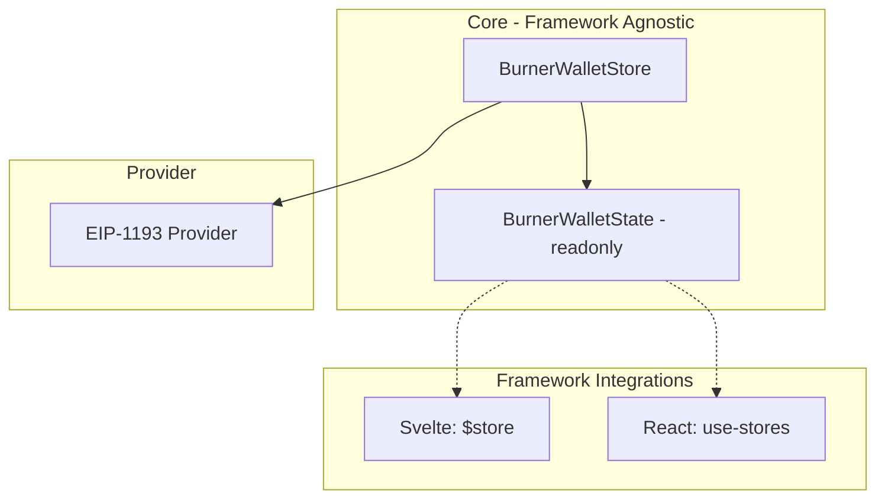

# Burner Wallet Refactoring Plan

> **Context**: This plan refactors `@etherkit/burner-wallet` to use a mnemonic-based HD wallet with a reactive store pattern. The package is at version 0.0.0 (unreleased), so this is a clean break with no backwards compatibility concerns.

## Goal

Refactor the burner wallet to be:
1. **Mnemonic-based (HD wallet)** - Single mnemonic, accounts derived sequentially by index
2. **Framework-agnostic** - No DOM/HTML dependencies in core
3. **Reactive** - Store pattern compatible with Svelte `$store` syntax and `use-stores` for React

## Proposed Architecture



## New API Design

### 1. BurnerWalletStore

```ts
export type BurnerWalletState = {
  /** The mnemonic phrase - null if not yet created */
  mnemonic: string | null;
  /** Number of accounts created */
  accountCount: number;
  /** Currently selected account index */
  selectedIndex: number;
  /** Derived addresses for all accounts */
  addresses: Hex[];
  /** Currently selected address */
  selectedAddress: Hex | null;
};

export type BurnerWalletStore = {
  /** Subscribe to state changes - returns unsubscribe function */
  subscribe: (listener: (state: BurnerWalletState) => void) => () => void;
  
  /** Get current state snapshot */
  get: () => BurnerWalletState;
  
  // === Mutation Methods ===
  
  /** Create new wallet with fresh mnemonic, returns the mnemonic */
  createWallet: () => string;
  
  /** Import existing mnemonic */
  importMnemonic: (mnemonic: string) => void;
  
  /** Add next account (sequential), auto-creates wallet if needed */
  addAccount: () => number;
  
  /** Select an account by index, auto-creates wallet if needed */
  selectAccount: (index: number) => void;
  
  /** Clear everything - mnemonic and all accounts */
  clearAll: () => void;
  
  // === Read Methods ===
  
  /** Get mnemonic (may return null if not created) */
  getMnemonic: () => string | null;
  
  /** Get private key for account at index */
  getPrivateKey: (index: number) => Hex;
  
  /** Get all private keys for active accounts */
  getPrivateKeys: () => Hex[];
  
  /** Get address for account at index */
  getAddress: (index: number) => Hex;
};
```

### 2. Factory Function

```ts
export type CreateBurnerWalletStoreOptions = {
  /** localStorage key prefix (default: 'burner-wallet:') */
  storagePrefix?: string;
};

export function createBurnerWalletStore(
  options?: CreateBurnerWalletStoreOptions
): BurnerWalletStore;
```

### 3. localStorage Schema

```json
{
  "burner-wallet:mnemonic": "word1 word2 ... word12",
  "burner-wallet:count": 3,
  "burner-wallet:selected": 0
}
```

## Framework Integration Examples

### Svelte

```svelte
<script>
  import { store } from './wallet';
  
  // $store auto-subscribes
</script>

<select bind:value={$store.selectedIndex} onchange={() => store.selectAccount($store.selectedIndex)}>
  {#each $store.addresses as addr, i}
    <option value={i}>{addr}</option>
  {/each}
</select>

<button onclick={() => store.addAccount()}>+ Add Account</button>
```

### React (with use-stores)

```tsx
import { useStore } from 'use-stores';
import { store } from './wallet';

function WalletSelector() {
  const state = useStore(store);
  // ...
}
```

## File Changes

| File | Action |
|------|--------|
| [`storage.ts`](../packages/burner-wallet/src/storage.ts) | Delete |
| `store.ts` | New - implements BurnerWalletStore |
| `types.ts` | New - shared type definitions |
| [`provider.ts`](../packages/burner-wallet/src/provider.ts) | Update to use new store |
| [`manager.ts`](../packages/burner-wallet/src/manager.ts) | Delete |
| [`init.ts`](../packages/burner-wallet/src/init.ts) | Update to use new store |
| [`index.ts`](../packages/burner-wallet/src/index.ts) | Update exports |

## Implementation Order

1. Create `types.ts` with new type definitions
2. Create `store.ts` implementing `BurnerWalletStore`
3. Update `provider.ts` to use the new store
4. Update `init.ts` 
5. Update `index.ts` exports
6. Delete `storage.ts` and `manager.ts`
7. Remove manager export from `package.json`
8. Update README
9. Update tests

## Design Decisions

- **Auto-create wallet**: `selectAccount()` and `addAccount()` auto-create wallet if none exists
- **Sequential accounts only**: No `addAccountAtIndex()`, accounts always created in order
- **No individual removal**: Only `clearAll()` to reset - keeps store simple
- **12-word mnemonic**: Standard BIP-39, 128 bits entropy
- **Clean break**: No backward compatibility with old random-key storage

---

## Implementation Details

### viem HD Wallet Functions

Use these functions from `viem/accounts`:

```ts
import {
  generateMnemonic,      // Generate 12-word mnemonic
  mnemonicToAccount,     // Derive account from mnemonic + index
  english                // Word list for mnemonic
} from 'viem/accounts';

// Generate new mnemonic
const mnemonic = generateMnemonic(english);  // Returns: "word1 word2 ... word12"

// Derive account at index
const account = mnemonicToAccount(mnemonic, { addressIndex: 0 });
account.address;     // Hex address
account.privateKey;  // Hex private key (need to access via account internals)
```

**Note**: To get the private key from an HD account, use:
```ts
import { HDKey } from 'viem/accounts';
import { mnemonicToSeed } from 'viem/accounts';

// Full derivation path: m/44'/60'/0'/0/{index}
const seed = await mnemonicToSeed(mnemonic);
const hdKey = HDKey.fromMasterSeed(seed);
const childKey = hdKey.derive("m/44'/60'/0'/0/0");
const privateKey = `0x${Buffer.from(childKey.privateKey!).toString('hex')}` as Hex;
```

Alternatively, since `mnemonicToAccount` returns an account with signing capabilities, you can derive the private key by:
```ts
import { mnemonicToAccount } from 'viem/accounts';

const account = mnemonicToAccount(mnemonic, { addressIndex: index });
// The account object has the private key internally - check viem source for access
// Or use the account directly for signing without exposing the key
```

### types.ts - Complete Implementation

```ts
// packages/burner-wallet/src/types.ts

export type Hex = `0x${string}`;

export type BurnerWalletState = {
  /** The mnemonic phrase - null if not yet created */
  mnemonic: string | null;
  /** Number of accounts created (0 to accountCount-1 are valid indices) */
  accountCount: number;
  /** Currently selected account index (0-based), 0 if no accounts */
  selectedIndex: number;
  /** Derived addresses for all accounts */
  addresses: Hex[];
  /** Currently selected address, null if no accounts */
  selectedAddress: Hex | null;
};

export type BurnerWalletStore = {
  /** Subscribe to state changes - returns unsubscribe function (Svelte store compatible) */
  subscribe: (listener: (state: BurnerWalletState) => void) => () => void;
  
  /** Get current state snapshot */
  get: () => BurnerWalletState;
  
  // === Mutation Methods ===
  
  /** Create new wallet with fresh 12-word mnemonic, returns the mnemonic */
  createWallet: () => string;
  
  /** Import existing mnemonic, resets account count to 1 */
  importMnemonic: (mnemonic: string) => void;
  
  /** Add next account (sequential), auto-creates wallet if needed, returns new index */
  addAccount: () => number;
  
  /** Select an account by index, auto-creates wallet if needed */
  selectAccount: (index: number) => void;
  
  /** Clear everything - mnemonic and all accounts */
  clearAll: () => void;
  
  // === Read Methods ===
  
  /** Get mnemonic (null if not created) */
  getMnemonic: () => string | null;
  
  /** Get private key for account at index (throws if index >= accountCount) */
  getPrivateKey: (index: number) => Hex;
  
  /** Get all private keys for accounts 0 to accountCount-1 */
  getPrivateKeys: () => Hex[];
  
  /** Get address for account at index (throws if index >= accountCount) */
  getAddress: (index: number) => Hex;
};

export type CreateBurnerWalletStoreOptions = {
  /** localStorage key prefix (default: 'burner-wallet:') */
  storagePrefix?: string;
};
```

### store.ts - Implementation Skeleton

```ts
// packages/burner-wallet/src/store.ts

import { generateMnemonic, mnemonicToAccount, english } from 'viem/accounts';
import type { Hex, BurnerWalletState, BurnerWalletStore, CreateBurnerWalletStoreOptions } from './types.js';

export function createBurnerWalletStore(
  options?: CreateBurnerWalletStoreOptions
): BurnerWalletStore {
  const prefix = options?.storagePrefix ?? 'burner-wallet:';
  const listeners = new Set<(state: BurnerWalletState) => void>();
  
  // Internal state
  let mnemonic: string | null = null;
  let accountCount = 0;
  let selectedIndex = 0;
  
  // Load from localStorage on init
  function load() {
    try {
      const storedMnemonic = localStorage.getItem(prefix + 'mnemonic');
      const storedCount = localStorage.getItem(prefix + 'count');
      const storedSelected = localStorage.getItem(prefix + 'selected');
      
      if (storedMnemonic) {
        mnemonic = storedMnemonic;
        accountCount = storedCount ? parseInt(storedCount, 10) : 1;
        selectedIndex = storedSelected ? parseInt(storedSelected, 10) : 0;
      }
    } catch {
      // localStorage unavailable
    }
  }
  
  function save() {
    try {
      if (mnemonic) {
        localStorage.setItem(prefix + 'mnemonic', mnemonic);
        localStorage.setItem(prefix + 'count', String(accountCount));
        localStorage.setItem(prefix + 'selected', String(selectedIndex));
      } else {
        localStorage.removeItem(prefix + 'mnemonic');
        localStorage.removeItem(prefix + 'count');
        localStorage.removeItem(prefix + 'selected');
      }
    } catch {
      // localStorage unavailable
    }
  }
  
  function deriveAddress(index: number): Hex {
    if (!mnemonic) throw new Error('No wallet created');
    const account = mnemonicToAccount(mnemonic, { addressIndex: index });
    return account.address as Hex;
  }
  
  function derivePrivateKey(index: number): Hex {
    if (!mnemonic) throw new Error('No wallet created');
    // Use viem's internal derivation
    // Note: mnemonicToAccount returns LocalAccount which has access to privateKey
    const account = mnemonicToAccount(mnemonic, { addressIndex: index });
    // The private key is accessible via the account's internal structure
    // Check viem source - may need to use HDKey directly
    // For now, derive using HDKey approach
    // ... implementation needed
    throw new Error('TODO: implement private key derivation');
  }
  
  function buildState(): BurnerWalletState {
    const addresses: Hex[] = [];
    if (mnemonic) {
      for (let i = 0; i < accountCount; i++) {
        addresses.push(deriveAddress(i));
      }
    }
    
    return {
      mnemonic,
      accountCount,
      selectedIndex,
      addresses,
      selectedAddress: addresses[selectedIndex] ?? null,
    };
  }
  
  function notify() {
    const state = buildState();
    for (const listener of listeners) {
      listener(state);
    }
  }
  
  function ensureWallet() {
    if (!mnemonic) {
      mnemonic = generateMnemonic(english);
      accountCount = 1;
      selectedIndex = 0;
      save();
    }
  }
  
  // Initialize
  load();
  
  // Log warning
  if (typeof console !== 'undefined') {
    console.warn(
      '[BurnerWalletStore] Mnemonic stored in localStorage (plain text). ' +
      'For development/testing only. Do not use with real funds.'
    );
  }
  
  return {
    subscribe(listener) {
      listeners.add(listener);
      listener(buildState()); // Immediate callback with current state (Svelte convention)
      return () => listeners.delete(listener);
    },
    
    get: buildState,
    
    createWallet() {
      mnemonic = generateMnemonic(english);
      accountCount = 1;
      selectedIndex = 0;
      save();
      notify();
      return mnemonic;
    },
    
    importMnemonic(newMnemonic: string) {
      // TODO: validate mnemonic
      mnemonic = newMnemonic;
      accountCount = 1;
      selectedIndex = 0;
      save();
      notify();
    },
    
    addAccount() {
      ensureWallet();
      const newIndex = accountCount;
      accountCount++;
      selectedIndex = newIndex;
      save();
      notify();
      return newIndex;
    },
    
    selectAccount(index: number) {
      ensureWallet();
      if (index < 0) throw new Error('Invalid index');
      // Auto-expand accounts if selecting beyond current count
      if (index >= accountCount) {
        accountCount = index + 1;
      }
      selectedIndex = index;
      save();
      notify();
    },
    
    clearAll() {
      mnemonic = null;
      accountCount = 0;
      selectedIndex = 0;
      save();
      notify();
    },
    
    getMnemonic: () => mnemonic,
    
    getPrivateKey(index: number) {
      if (!mnemonic) throw new Error('No wallet created');
      if (index < 0 || index >= accountCount) throw new Error('Invalid index');
      return derivePrivateKey(index);
    },
    
    getPrivateKeys() {
      if (!mnemonic) return [];
      const keys: Hex[] = [];
      for (let i = 0; i < accountCount; i++) {
        keys.push(derivePrivateKey(i));
      }
      return keys;
    },
    
    getAddress(index: number) {
      if (!mnemonic) throw new Error('No wallet created');
      if (index < 0 || index >= accountCount) throw new Error('Invalid index');
      return deriveAddress(index);
    },
  };
}
```

### provider.ts - Key Changes

The provider needs to:
1. Accept a `BurnerWalletStore` instead of creating `BurnerKeyStorage`
2. Use `store.getPrivateKeys()` to get keys for signing
3. Listen to store changes via `store.subscribe()` and emit `accountsChanged`

```ts
// Key changes in provider.ts:

export type BurnerWalletProviderOptions = {
  nodeURL: string;
  store: BurnerWalletStore;  // Changed from storageKey
};

export function createBurnerWalletProvider(
  options: BurnerWalletProviderOptions
): EIP1193Provider {
  const { nodeURL, store } = options;
  
  // Subscribe to store changes
  store.subscribe((state) => {
    // Rebuild provider with new keys and emit accountsChanged
    rebuildAndNotify();
  });
  
  // Use store.getPrivateKeys() instead of storage.getPrivateKeys()
  // ...
}
```

### init.ts - Key Changes

```ts
// init.ts should:
// 1. Create store
// 2. Create provider with store
// 3. Announce via EIP-6963
// 4. Return { provider, store, cleanup }

export type BurnerWalletInstance = {
  provider: EIP1193Provider;
  store: BurnerWalletStore;  // Changed from storage
  cleanup: () => void;
};
```

### index.ts - New Exports

```ts
// packages/burner-wallet/src/index.ts

export { createBurnerWalletStore } from './store.js';
export type {
  Hex,
  BurnerWalletState,
  BurnerWalletStore,
  CreateBurnerWalletStoreOptions
} from './types.js';
export { createBurnerWalletProvider } from './provider.js';
export type { BurnerWalletProviderOptions } from './provider.js';
export { BURNER_WALLET_SVG, BURNER_WALLET_ICON_DATA_URI } from './icon.js';
export { announceBurnerWallet } from './announcer.js';
export type {
  EIP6963ProviderInfo,
  EIP6963ProviderDetail,
  AnnounceBurnerWalletOptions,
} from './announcer.js';
export { initBurnerWallet } from './init.js';
export type { InitBurnerWalletOptions, BurnerWalletInstance } from './init.js';
```

### package.json Changes

Remove the manager export:

```diff
  "exports": {
    ".": {
      "types": "./dist/index.d.ts",
      "import": "./dist/index.js"
-   },
-   "./manager": {
-     "types": "./dist/manager.d.ts",
-     "import": "./dist/manager.js"
    }
  },
```

### Test Scenarios

1. **Store creation** - Creates with default options
2. **createWallet** - Generates valid 12-word mnemonic
3. **importMnemonic** - Accepts valid mnemonic, resets state
4. **addAccount** - Auto-creates wallet, increments count, selects new account
5. **selectAccount** - Auto-creates wallet, expands count if needed
6. **clearAll** - Resets all state to null/0
7. **getMnemonic** - Returns mnemonic or null
8. **getPrivateKey** - Returns valid hex private key
9. **getAddress** - Returns valid hex address
10. **subscribe** - Calls listener immediately, then on changes
11. **localStorage persistence** - State survives reload (mock localStorage in tests)
12. **Provider integration** - Provider uses store, emits accountsChanged on store changes
