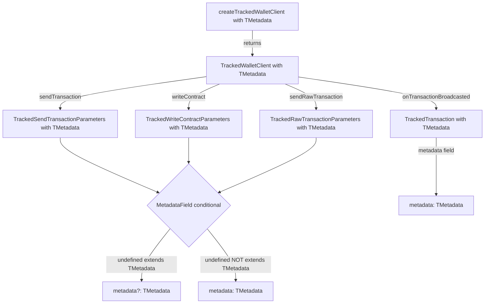

# Generic Metadata Type for TrackedWalletClient

## Overview

Add a generic `TMetadata` type parameter to `createTrackedWalletClient` so that:
- Metadata is a **mandatory field** when the user provides a concrete type
- Metadata can be **omitted** when the user explicitly allows `undefined` in the type (e.g., `MyMeta | undefined`)

## Design Decisions

| Decision | Choice |
|----------|--------|
| Default behavior | No default - user must explicitly specify TMetadata |
| TrackedTransaction.metadata | Typed as TMetadata directly (can be undefined if user allows) |
| Generic naming | `TMetadata` |

## Type System Design

### Core Conditional Type

```typescript
// If undefined extends TMetadata, metadata is optional
// Otherwise, metadata is required
export type MetadataField<TMetadata> = undefined extends TMetadata
  ? { metadata?: TMetadata }
  : { metadata: TMetadata };
```

### Usage Patterns

**Pattern 1: Required metadata**
```typescript
interface MyMeta { txType: string; correlationId: string }
// TMetadata first - clean syntax!
const client = createTrackedWalletClient<MyMeta>(walletClient, publicClient);
// metadata field is REQUIRED - TypeScript error if omitted
await client.sendTransaction({
  to: recipient,
  value: 100n,
  metadata: { txType: 'transfer', correlationId: 'abc-123' }
});
```

**Pattern 2: Optional metadata**
```typescript
interface MyMeta { txType: string }
// Include undefined to make metadata optional
const client = createTrackedWalletClient<MyMeta | undefined>(walletClient, publicClient);
// metadata field is OPTIONAL
await client.sendTransaction({
  to: recipient,
  value: 100n,
  // metadata can be omitted entirely
});
```

## Files to Modify

### 1. packages/viem-tx-tracker/src/types.ts

**Add MetadataField helper type:**
```typescript
/**
 * Conditional type that makes metadata required or optional based on TMetadata.
 * If TMetadata includes undefined, metadata is optional.
 * Otherwise, metadata is required.
 */
export type MetadataField<TMetadata> = undefined extends TMetadata
  ? { metadata?: TMetadata }
  : { metadata: TMetadata };
```

**Update TrackedWriteContractParameters:**
- Add `TMetadata` type parameter (no default)
- Replace `metadata?: TransactionMetadata` with `& MetadataField<TMetadata>`

**Update TrackedSendTransactionParameters:**
- Add `TMetadata` type parameter (no default)
- Replace `metadata?: TransactionMetadata` with `& MetadataField<TMetadata>`

**Update TrackedRawTransactionParameters:**
- Convert to generic type with `TMetadata` parameter
- Replace `metadata?: TransactionMetadata` with `& MetadataField<TMetadata>`

**Update TrackedWalletClient interface:**
- Add `TMetadata` as **first** type parameter (no default)
- Update all method signatures to use `TMetadata`
- Update `TrackedTransaction` type in event methods to use `TMetadata`

**Update TrackedTransaction:**
- Keep generic parameter `M`
- Change `metadata: M` to remain as-is (the conditional is at the parameter level, not the stored type)

### 2. packages/viem-tx-tracker/src/TrackedWalletClient.ts

**Update createTrackedWalletClient function:**
```typescript
export function createTrackedWalletClient<
  TMetadata,  // First - mandatory, no default
  TTransport extends Transport = Transport,
  TChain extends Chain | undefined = Chain | undefined,
  TAccount extends Account | undefined = Account | undefined,
>(
  walletClient: WalletClient<TTransport, TChain, TAccount>,
  publicClient: PublicClient,
): TrackedWalletClient<TMetadata, TTransport, TChain, TAccount>
```

**Rationale:** Placing `TMetadata` first allows simpler usage since it's mandatory:
```typescript
// Clean - only specify the mandatory type
const client = createTrackedWalletClient<MyMeta>(walletClient, publicClient);

// vs having to specify all preceding types
const client = createTrackedWalletClient<Transport, Chain, Account, MyMeta>(...);
```

**Update createTrackedTransaction internal function:**
- Use `TMetadata` instead of `M extends TransactionMetadata`
- Remove the `metadata ?? {}` fallback since metadata handling is now type-driven

**Update emitter type:**
```typescript
const emitter = new Emitter<{
  'transaction:broadcasted': TrackedTransaction<TMetadata>;
}>();
```

**Update executeTrackedTransaction helper:**
- Type `metadata` parameter appropriately based on `TMetadata`

### 3. packages/viem-tx-tracker/test/index.test.ts

**Update tests to use new type pattern:**
- Define test metadata types
- Update `createTrackedWalletClient` calls with explicit type parameter
- Update existing tests that don't provide metadata to use `| undefined` pattern

## Implementation Checklist

- [ ] Add `MetadataField<TMetadata>` conditional type to types.ts
- [ ] Update `TrackedWriteContractParameters` with `TMetadata` generic
- [ ] Update `TrackedSendTransactionParameters` with `TMetadata` generic  
- [ ] Update `TrackedRawTransactionParameters` with `TMetadata` generic
- [ ] Update `TrackedWalletClient` interface with `TMetadata` generic
- [ ] Update `createTrackedWalletClient` function signature
- [ ] Update internal `createTrackedTransaction` function
- [ ] Update emitter type definition
- [ ] Update test file with proper type parameters
- [ ] Verify TypeScript compilation passes
- [ ] Run tests to ensure functionality works

## Type Flow Diagram



## Example After Implementation

```typescript
// Define your metadata type
interface AppMeta {
  action: 'swap' | 'transfer' | 'approve';
  userId: string;
}

// Create client with REQUIRED metadata - TMetadata first for clean syntax!
const strictClient = createTrackedWalletClient<AppMeta>(walletClient, publicClient);

// TypeScript ERROR - metadata is required
strictClient.sendTransaction({ to: addr, value: 1n });

// OK - metadata provided
strictClient.sendTransaction({
  to: addr,
  value: 1n,
  metadata: { action: 'transfer', userId: 'u123' }
});

// Create client with OPTIONAL metadata
const flexClient = createTrackedWalletClient<AppMeta | undefined>(walletClient, publicClient);

// OK - metadata can be omitted
flexClient.sendTransaction({ to: addr, value: 1n });

// Also OK - metadata provided
flexClient.sendTransaction({
  to: addr,
  value: 1n,
  metadata: { action: 'transfer', userId: 'u123' }
});

// Event listener gets properly typed metadata
strictClient.onTransactionBroadcasted((tx) => {
  // tx.metadata is typed as AppMeta (not undefined)
  console.log(tx.metadata.action);
});

flexClient.onTransactionBroadcasted((tx) => {
  // tx.metadata is typed as AppMeta | undefined
  if (tx.metadata) {
    console.log(tx.metadata.action);
  }
});
```
