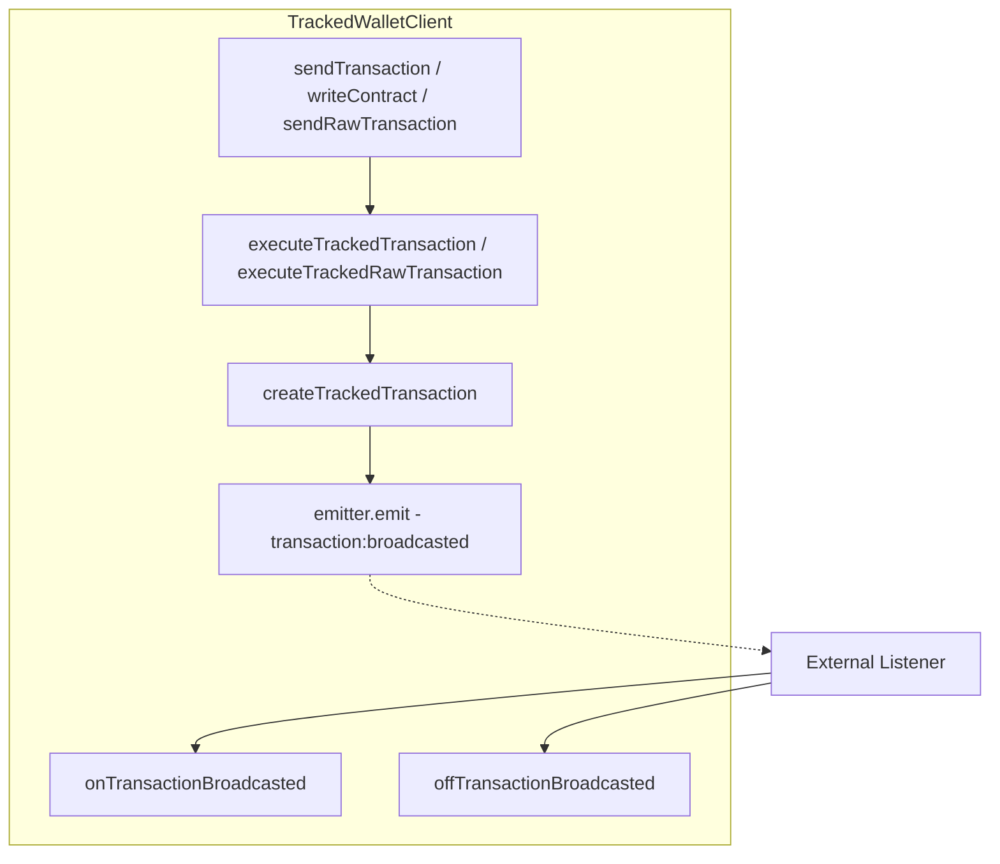

# Implementation Plan: Add Transaction Broadcast Events

## Overview

Add event emission functionality using `radiate` to notify listeners when transactions are broadcast. This follows the same pattern used in the [`tx-observer`](../packages/tx-observer/src/index.ts) package.

## Requirements

- Use `radiate` library (already a dependency in package.json v^0.3.2)
- Expose `onTransactionBroadcasted` and `offTransactionBroadcasted` as methods on the `TrackedWalletClient` object
- Event payload should be the existing `TrackedTransaction` type

## Architecture



## Changes Required

### 1. TrackedWalletClient.ts

**File:** `packages/viem-tx-tracker/src/TrackedWalletClient.ts`

#### Add import

```typescript
import {Emitter} from 'radiate';
```

#### Add local import for TrackedTransaction type

```typescript
import type {TrackedTransaction} from './types.js';
```

#### Create emitter inside createTrackedWalletClient function

```typescript
const emitter = new Emitter<{
    'transaction:broadcasted': TrackedTransaction;
}>();
```

#### Replace TODO comments (lines 259-260 and 296-297)

**Before:**
```typescript
// TODO: emit('transaction:sent', trackedTx)
void trackedTx; // Suppress unused variable warning until emit is implemented
```

**After:**
```typescript
emitter.emit('transaction:broadcasted', trackedTx);
```

#### Add methods to returned object

Add these methods to the object returned by `createTrackedWalletClient`:

```typescript
return {
    walletClient,
    publicClient,
    // ... existing methods ...
    
    onTransactionBroadcasted: (
        listener: (event: TrackedTransaction) => void
    ) => emitter.on('transaction:broadcasted', listener),
    
    offTransactionBroadcasted: (
        listener: (event: TrackedTransaction) => void
    ) => emitter.off('transaction:broadcasted', listener),
};
```

### 2. types.ts

**File:** `packages/viem-tx-tracker/src/types.ts`

Update the `TrackedWalletClient` interface (around line 195) to include the new methods:

```typescript
export interface TrackedWalletClient<
    TTransport extends Transport = Transport,
    TChain extends Chain | undefined = Chain | undefined,
    TAccount extends Account | undefined = Account | undefined,
> {
    // ... existing members ...
    
    /**
     * Subscribe to transaction broadcast events.
     * Called immediately after a transaction is successfully broadcast.
     * @param listener - Callback function receiving TrackedTransaction
     * @returns Unsubscribe function
     */
    onTransactionBroadcasted(
        listener: (event: TrackedTransaction) => void
    ): () => void;
    
    /**
     * Unsubscribe from transaction broadcast events.
     * @param listener - The same listener function passed to onTransactionBroadcasted
     */
    offTransactionBroadcasted(
        listener: (event: TrackedTransaction) => void
    ): void;
}
```

### 3. index.ts

**File:** `packages/viem-tx-tracker/src/index.ts`

No changes needed - `TrackedTransaction` is already exported.

## Event Payload

The event payload is the existing `TrackedTransaction` type from `types.ts`:

```typescript
interface TrackedTransaction<M extends TransactionMetadata = TransactionMetadata> {
    trackingId: string;      // Custom ID or auto-generated UUID
    txHash: Hash;            // Transaction hash
    from: Address;           // Sender address
    nonce: number;           // Transaction nonce
    chainId: number;         // Chain ID
    metadata: M;             // User-provided metadata
    initiatedAt: number;     // Timestamp (ms since epoch)
    request: unknown;        // Original request data
}
```

## Usage Example

```typescript
import {createTrackedWalletClient} from '@etherkit/viem-tx-tracker';

const trackedClient = createTrackedWalletClient(walletClient, publicClient);

// Subscribe to broadcast events
const listener = (tx) => {
    console.log(`Transaction ${tx.txHash} broadcasted with nonce ${tx.nonce}`);
    console.log(`Tracking ID: ${tx.trackingId}`);
};

trackedClient.onTransactionBroadcasted(listener);

// Send a transaction - listener will be called
await trackedClient.sendTransaction({
    to: '0x...',
    value: parseEther('1'),
    metadata: { title: 'Send ETH' }
});

// Later: unsubscribe
trackedClient.offTransactionBroadcasted(listener);
```

## Todo Checklist

- [ ] Update TrackedWalletClient.ts - Import Emitter from radiate
- [ ] Update TrackedWalletClient.ts - Import TrackedTransaction type
- [ ] Update TrackedWalletClient.ts - Create emitter with typed TransactionBroadcasted event
- [ ] Update TrackedWalletClient.ts - Replace TODO comments with actual emit calls
- [ ] Update TrackedWalletClient.ts - Add onTransactionBroadcasted and offTransactionBroadcasted methods to returned object
- [ ] Update types.ts - Add onTransactionBroadcasted/offTransactionBroadcasted to TrackedWalletClient interface
- [ ] Verify implementation by running typecheck
