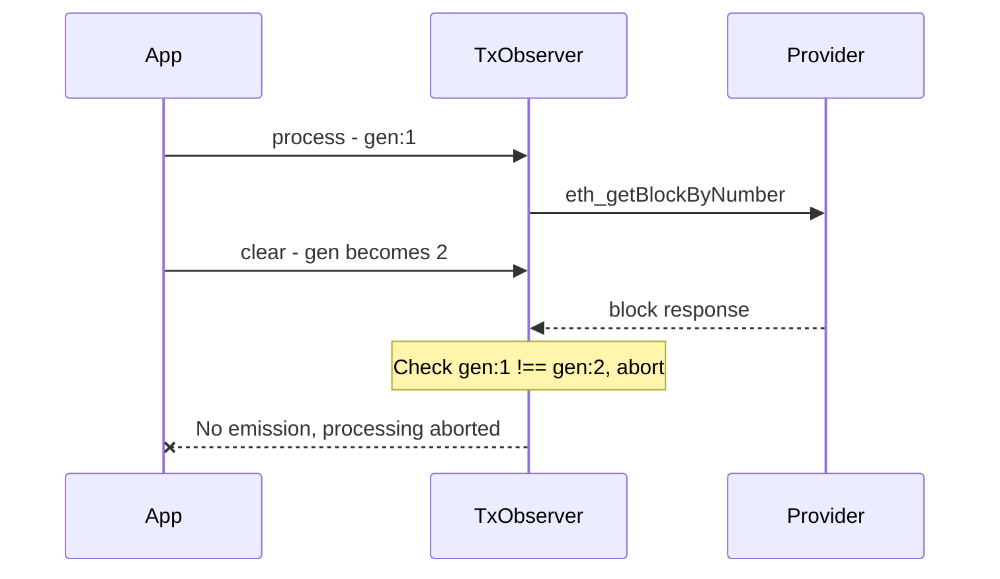

# TX Observer Clear Abort Implementation Plan

## Problem Statement

When `clear()` is called on the tx-observer (e.g., when switching accounts), any in-progress `process()` calls continue executing and may emit events for the previous account's transactions. This creates a race condition where:

1. Account A's transactions are being processed
2. User switches to Account B, calling `clear()`  
3. `addMultiple()` is called with Account B's transactions
4. In-flight RPC calls for Account A complete and emit events
5. App receives updates for Account A transactions when Account B is active

## Current Behavior

The existing check at line 446 in [`index.ts`](../packages/tx-observer/src/index.ts:446):

```typescript
if (intentsById[id]) {
  // emit events
}
```

Only verifies the intent still exists, but doesn't handle:
- Same ID being used for different accounts
- Unnecessary RPC calls continuing after clear

## Solution: Session Counter Pattern

### Overview

Introduce a `clearGeneration` counter that increments on each `clear()` call. Processing functions capture the generation at start and abort if it changes.



### Implementation Details

#### 1. Add Session Counter

```typescript
let clearGeneration = 0;

function clear() {
  logger.debug(`clearing transactions...`);
  clearGeneration++;  // Increment generation
  
  const keys = Object.keys(intentsById);
  for (const key of keys) {
    const intent = intentsById[key];
    for (const transaction of intent.transactions) {
      delete txToIntent[transaction.hash];
    }
    delete intentsById[key];
  }
  if (emitter.hasListeners('intents:cleared')) {
    emitter.emit('intents:cleared', undefined);
  }
}
```

#### 2. Capture Generation at Process Start

```typescript
async function process() {
  if (!provider) {
    return;
  }
  
  // Capture generation at start
  const startGeneration = clearGeneration;
  
  const latestBlock = await provider.request({
    method: 'eth_getBlockByNumber',
    params: ['latest', false],
  });

  // Check after each await
  if (clearGeneration !== startGeneration) {
    logger.debug('process aborted: clear() was called');
    return;
  }
  // ... rest of processing
}
```

#### 3. Pass Generation Through Processing Chain

```typescript
async function processTransactionIntent(
  id: string,
  intent: TransactionIntent,
  context: {
    latestBlockNumber: number;
    latestBlockTime: number;
    latestFinalizedBlock: EIP1193Block;
    latestFinalizedBlockTime: number;
    startGeneration: number;  // Add this
  }
): Promise<boolean> {
  // Check generation before each transaction
  for (const transaction of attemptsSnapshot) {
    if (clearGeneration !== context.startGeneration) {
      return false;  // Abort
    }
    const changed = await processAttempt(transaction, context);
    // ...
  }
  
  // Final check before emission
  if (clearGeneration !== context.startGeneration) {
    return false;
  }
  // ... emit events
}
```

#### 4. Check in processAttempt Before Each RPC Call

```typescript
async function processAttempt(
  transaction: BroadcastedTransaction,
  context: {
    // ... existing fields
    startGeneration: number;
  }
): Promise<boolean> {
  if (!provider || clearGeneration !== context.startGeneration) {
    return false;
  }

  const txFromPeers = await provider.request({
    method: 'eth_getTransactionByHash',
    params: [transaction.hash],
  });

  // Check after RPC call
  if (clearGeneration !== context.startGeneration) {
    return false;
  }
  
  // ... rest of logic with similar checks after each await
}
```

### Abort Points

The following locations need generation checks:

| Location | After/Before | Purpose |
|----------|--------------|---------|
| `process()` line 342-345 | After `eth_getBlockByNumber` latest | Prevent unnecessary finalized block fetch |
| `process()` line 361-364 | After `eth_getBlockByNumber` finalized | Prevent intent iteration |
| `process()` line 373 | Before each intent loop iteration | Skip remaining intents |
| `processTransactionIntent()` line 413 | Before each transaction loop | Skip remaining txs |
| `processTransactionIntent()` line 446 | Before emissions | Prevent stale emissions |
| `processAttempt()` line 498 | After `eth_getTransactionByHash` | Prevent receipt fetch |
| `processAttempt()` line 507 | After `eth_getTransactionReceipt` | Prevent block fetch |
| `processAttempt()` line 513 | After `eth_getBlockByHash` | Prevent state mutation |
| `processAttempt()` line 585-588 | After second `eth_getTransactionByHash` | Prevent nonce check |
| `processAttempt()` line 595-598 | After `eth_getTransactionCount` | Prevent state mutation |

### Alternative: AbortController with Promise.race

For truly aborting in-flight requests, we could wrap provider requests:

```typescript
let abortController: AbortController | null = null;

function clear() {
  // Abort any in-flight requests
  if (abortController) {
    abortController.abort();
  }
  abortController = new AbortController();
  // ... rest of clear
}

async function abortableRequest<T>(request: Promise<T>): Promise<T | null> {
  if (!abortController) return request;
  
  return Promise.race([
    request,
    new Promise<null>((_, reject) => {
      abortController!.signal.addEventListener('abort', () => {
        reject(new Error('Request aborted'));
      });
    })
  ]).catch(err => {
    if (err.message === 'Request aborted') {
      return null;
    }
    throw err;
  });
}
```

**Note:** This doesn't actually cancel the network request (EIP-1193 doesn't support abort signals), but it does:
- Immediately return control flow
- Prevent processing of the result

### Recommendation

Start with the **session counter approach** as it's simpler and sufficient for the use case. The counter checks prevent:
- State mutations from old sessions
- Event emissions from old sessions  
- Unnecessary RPC calls (by checking before each call)

The in-flight requests will complete on the network side, but their results will be discarded.

## Test Cases

### Test 1: Clear During Block Fetch

```typescript
it('should abort processing when clear() is called during block fetch', async () => {
  // Add intent for Account A
  observer.add('intent-1', accountAIntent);
  
  // Start processing, pause at block fetch
  controller.setLatency(100);
  const processPromise = observer.process();
  
  // Clear while waiting for block
  await sleep(50);
  observer.clear();
  observer.addMultiple({ 'intent-1': accountBIntent });
  
  await processPromise;
  
  // Verify no emissions for Account A
  expect(statusEvents).toHaveLength(0);
});
```

### Test 2: Clear During Transaction Processing

```typescript
it('should abort when clear() called mid-transaction', async () => {
  // Add multiple intents
  observer.addMultiple({ 
    'intent-1': intent1,
    'intent-2': intent2,
  });
  
  let processedCount = 0;
  controller.onRequest(async () => {
    processedCount++;
    if (processedCount === 3) {
      observer.clear();
    }
  });
  
  await observer.process();
  
  // Should have stopped after intent-1
  expect(statusEvents.filter(e => e.id === 'intent-2')).toHaveLength(0);
});
```

### Test 3: No Stale Emissions After Clear

```typescript
it('should not emit events for old session after clear + re-add', async () => {
  const events: TransactionIntentEvent[] = [];
  observer.on('intent:status', (e) => events.push(e));
  
  // Start processing Account A
  observer.add('shared-id', accountAIntent);
  const processPromise = observer.process();
  
  // Switch to Account B immediately
  observer.clear();
  observer.add('shared-id', accountBIntent);
  
  await processPromise;
  
  // Verify any emitted events are for Account B
  for (const event of events) {
    expect(event.intent.transactions[0].from).toBe(accountBAddress);
  }
});
```

## Migration Impact

- **API**: No breaking changes - `clear()` signature unchanged
- **Behavior**: Processing now aborts on `clear()` instead of continuing
- **Events**: Fewer spurious events emitted during account switches

## Files to Modify

1. [`packages/tx-observer/src/index.ts`](../packages/tx-observer/src/index.ts) - Core implementation
2. New test file: `packages/tx-observer/test/integration/clear-abort.test.ts`
3. [`packages/tx-observer/README.md`](../packages/tx-observer/README.md) - Document behavior
